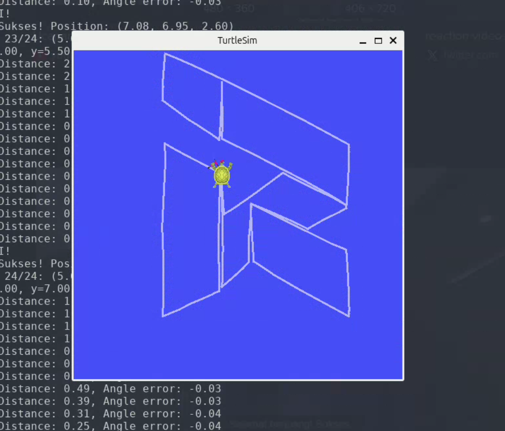

# Turtle Painter


## Penjelasan Singkat
Program menggambarkan logo ITS Robocon menggunakan turtlesim_node, program ini bekerja dengan memanfaatkan action server. Action server ini berfungsi menggerakan turtle ke koordinat yang diinginkan dan menggunakan PID untuk meng-kontol posisi dan hadapan.

## Cara menjalankan program
```bash
git clone https://github.com/daffarandika/turtle_movement_ws
cd turtle_movement_ws
rosdep update
rosdep install --from-paths src --ignore-src -r -y
colcon build
source install/setup.sh
ros2 launch turtle_bringup paint.launch.py

```
